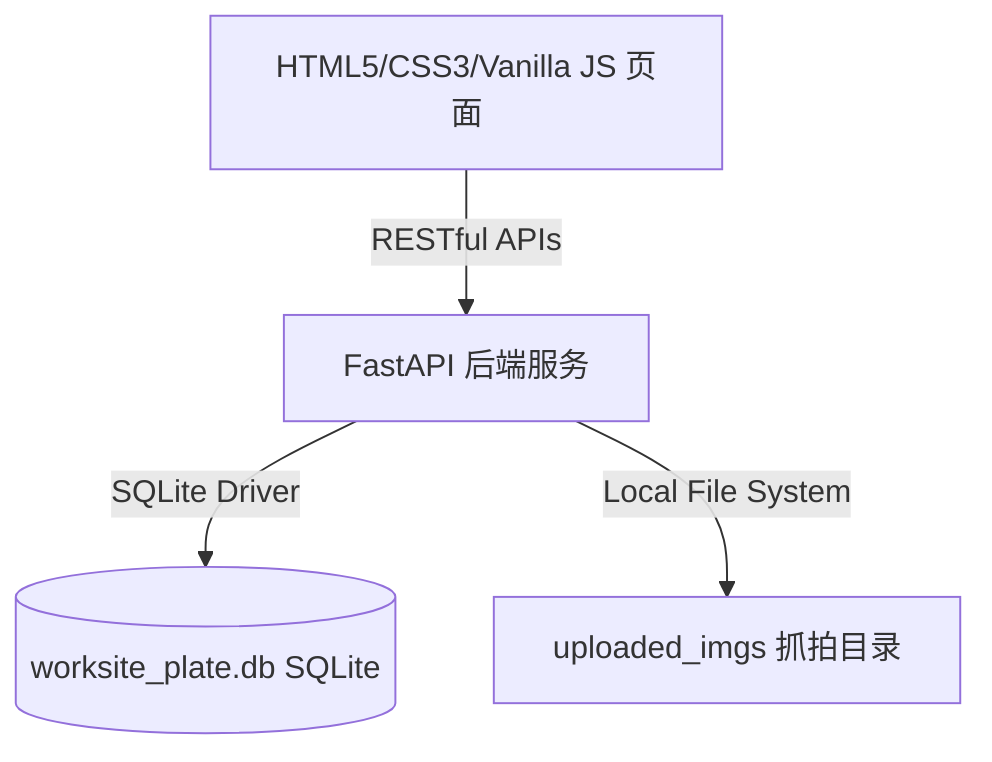

# 工地车辆记账与结算对账系统 - 技术设计文档

## 1. 系统架构设计

本系统使用轻量级的前后端分离架构，通过 Python 服务提供 RESTful 接口，并采用内存/本地 SQLite 数据库持久化数据，保证在弱网或本地单机环境下的高可用与零配置部署。



---

## 2. 数据库设计 (SQLite)

数据库名称: `worksite_plate.db`

### 2.1 车辆通行日志表 `vehicle_records`
用于存储摄像头自动识别流水与管理员手工记账流水。

| 字段名 | 类型 | 约束 | 说明 |
| :--- | :--- | :--- | :--- |
| `id` | INTEGER | PRIMARY KEY AUTOINCREMENT | 记录主键 |
| `plate_no` | TEXT | NOT NULL | 车牌号码 (大写) |
| `plate_color` | TEXT | DEFAULT '蓝色' | 车牌颜色 |
| `direction` | TEXT | NOT NULL | 进出方向 ('IN' / 'OUT') |
| `pass_time` | TEXT | NOT NULL | 通行/记账时间 (格式: `YYYY-MM-DD HH:MM:SS`) |
| `image_path` | TEXT | NULL | 抓拍照文件名 (手工录入为空) |
| `confidence` | REAL | DEFAULT 1.0 | 识别置信度 (手工录入为 1.0) |
| `dump_site` | TEXT | DEFAULT '未分配' | 对账去向消纳点名称 |
| `soil_type` | TEXT | DEFAULT '渣土' | 拉运土方类型 |

* **索引设计**：
  - `idx_records_pass_time` 用于加速按日期的流水检索。
  - `idx_records_plate` 用于加速特定车辆轨迹和联想匹配的检索。

### 2.2 消纳地名册表 `dump_sites`
存储系统支持的结算对账地点及费率单价。

| 字段名 | 类型 | 约束 | 说明 |
| :--- | :--- | :--- | :--- |
| `id` | INTEGER | PRIMARY KEY AUTOINCREMENT | 主键 |
| `name` | TEXT | UNIQUE NOT NULL | 场地名称 |
| `unit_price` | REAL | DEFAULT 0.0 | 结算单价 (元/趟) |

### 2.3 常用车辆库 `frequent_plates`
自动累计并常驻的车牌数据，为记账提供智能联想候选。

| 字段名 | 类型 | 约束 | 说明 |
| :--- | :--- | :--- | :--- |
| `id` | INTEGER | PRIMARY KEY AUTOINCREMENT | 主键 |
| `plate_no` | TEXT | UNIQUE NOT NULL | 车牌号 (大写) |
| `plate_color` | TEXT | DEFAULT '蓝色' | 车牌颜色 |

### 2.4 默认路由表 `vehicle_bindings`
管理车辆与默认对账场地的绑定关系，进行智能化出场判定。

| 字段名 | 类型 | 约束 | 说明 |
| :--- | :--- | :--- | :--- |
| `id` | INTEGER | PRIMARY KEY AUTOINCREMENT | 主键 |
| `plate_no` | TEXT | UNIQUE NOT NULL | 车牌号 |
| `default_dump_site` | TEXT | NOT NULL | 默认消纳场地 |

---

## 3. 后端 API 接口设计

### 3.1 `GET /api/records`
查询指定日期的所有通行记录与汇总指标。
* **Query 参数**：`date` (格式: `YYYY-MM-DD`，可选，默认当天)
* **Response 返回值**：
  ```json
  {
    "success": true,
    "selected_date": "2026-06-01",
    "is_today": true,
    "kpis": {
      "total_in": 12,
      "total_out": 24,
      "current_stay": 1,
      "total_cost": 4200.0,
      "unassigned_out": 3
    },
    "records": [
      {
        "id": 105,
        "plate_no": "粤B9988D",
        "plate_color": "黄色",
        "direction": "OUT",
        "pass_time": "2026-06-01 11:20:00",
        "image_url": "/uploaded_imgs/capture_abc.jpg",
        "confidence": "0.98",
        "dump_site": "北山山脚卸土点",
        "soil_type": "级配石"
      }
    ]
  }
  ```

### 3.2 `GET /api/analytics`
获取大屏所需的统计报表数据。
* **Query 参数**：`date` (可选，默认当天)
* **Response 返回值**：
  ```json
  {
    "success": true,
    "date": "2026-06-01",
    "sites": [
      { "site_name": "北山山脚卸土点", "trips": 12, "trucks": 8, "cost": 2400.0 }
    ],
    "soils": [
      { "soil_type": "渣土", "trips": 8, "trucks": 5, "cost": 1600.0 }
    ],
    "daily": [
      { "day_date": "2026-05-30", "trips": 18, "cost": 3600.0 }
    ]
  }
  ```

### 3.3 `POST /api/add_manual_trip`
管理员手工补录/直接记账一趟运输记录。
* **Request 载荷**：
  ```json
  {
    "plate_no": "粤B8888D",
    "plate_color": "蓝色",
    "direction": "OUT",
    "pass_time": "2026-06-01 11:45:00",
    "dump_site": "北山山脚卸土点",
    "soil_type": "好土"
  }
  ```

### 3.4 `POST /api/adjust_trip_destination`
微调单趟通行记录的消纳去向与土质类型。
* **Request 载荷**：
  ```json
  {
    "record_id": 105,
    "dump_site": "东沙湾卸土点",
    "soil_type": "二混子"
  }
  ```

### 3.5 `DELETE /api/delete_manual_trip/{record_id}`
物理删除手工录入的废记录，防范重复录错。

---

## 4. 前端设计与组件规划

本系统采用极简的 **HTML5/CSS3/Vanilla JS** 组合开发，零框架依赖，渲染延迟低至毫秒级。

### 4.1 UI 布局划分
* **`.sidebar` 导航区**：固定在左侧，负责页面 tab 切换、展示当前系统在线状态与动态时钟。
* **`.main-header` 头部区**：支持全局选择对账日期，切换深浅色主题，动态呈现数据导出按钮。
* **数据图表渲染 (基于原生 SVG 与 气泡 Tooltip)**：
  - 折线趋势图使用 SVG 绝对视口 (`viewBox`) 进行车运趟数点位的动态按比例映射。
  - 各类占比均使用动态 HTML 节点进度条模拟，具有极佳的渲染流畅度。

### 4.2 记账表单联动逻辑 (IN/OUT 切换)
当记账员切换方向为 `IN` 时，通过 DOM 操作：
```javascript
document.getElementById('manual-site-group').style.display = 'none';
document.getElementById('manual-soil-group').style.display = 'none';
```
切换为 `OUT` 时还原：
```javascript
document.getElementById('manual-site-group').style.display = 'block';
document.getElementById('manual-soil-group').style.display = 'block';
```
这能大幅减少录入空车时的无效字段，优化现场效率。
